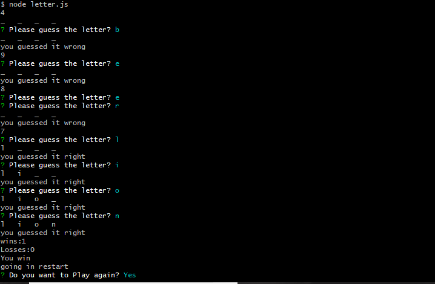

# Constructor_Hangman

Constructor_ Hangman is hangman game but it is developer using constructors in nodeJS.

Following is how the application works:

* Start Game and guessing correctly

* Continuing the game

* Losing a game

* exiting the game

